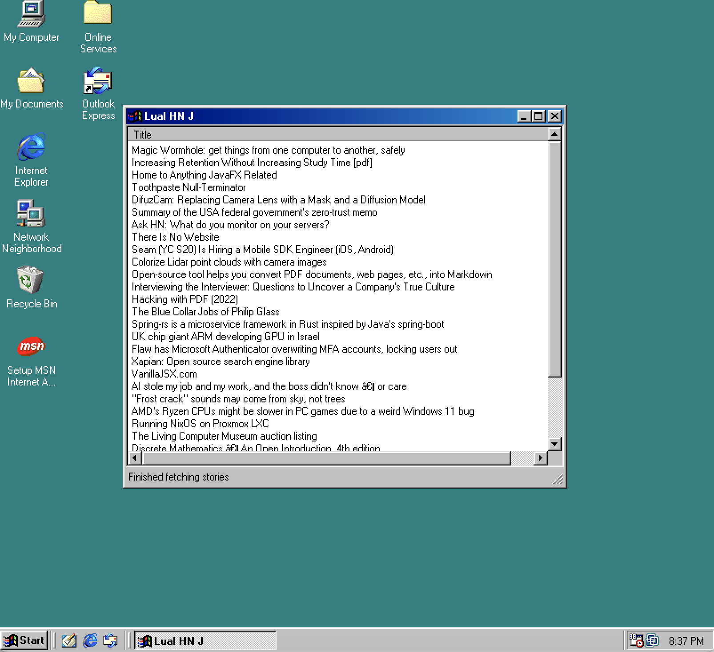
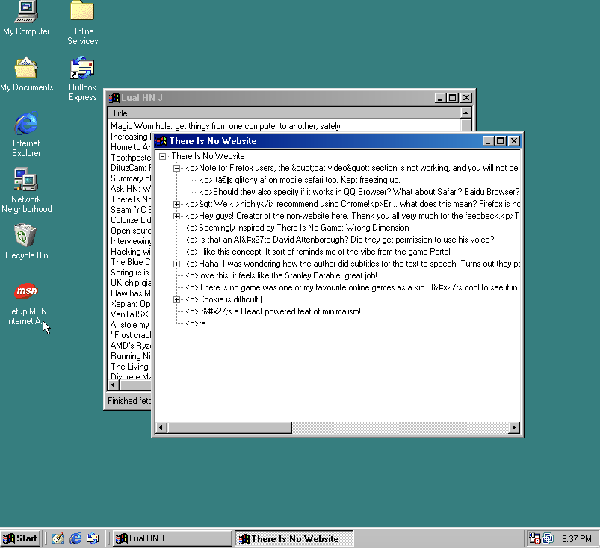

# LualHNJPlusPlus
HN news client for Win 9X machines written in Visual J++ 6.0

This is just a toy project to play with old programming languages.
I feel that Visual J++ was a really unique thing to take a look at.

This project includes a highish HTTP level client and a really basic
ChatGPT level JSON parser in standard Java 1.1.

The interface is built using com.ms.wfc which is a native binding of
Windows controls to Java and it won't run anywhere else.

I built this proyect in a Windows 98 VM and it runs fine there, but it
won't run in Windows XP, for example.

Currently is requires a HTTP CORS anywhere proxy server to connect to
a HN API, because they don't offer connecting without HTTPS.
Currently the URL of the proxy server is hardcoded in HNClient.

